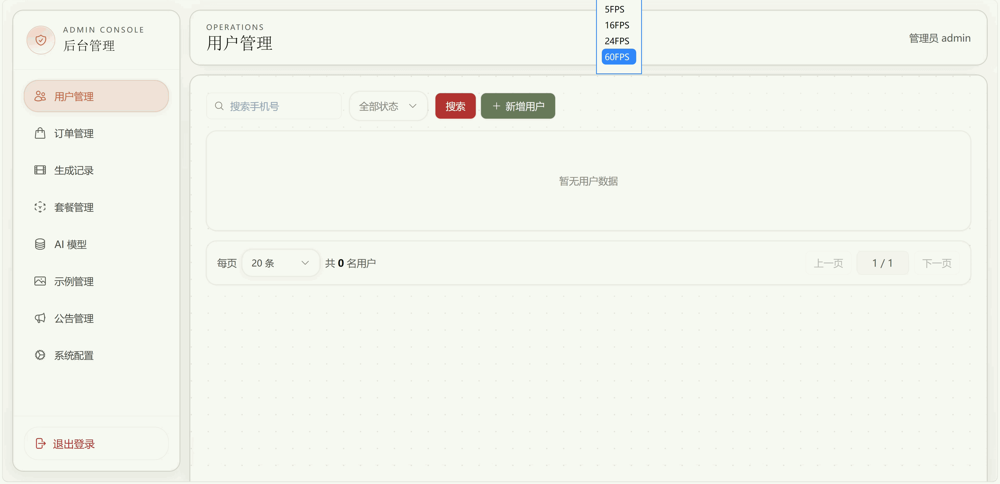

# AIGC

一个前后端分离的 AIGC 平台项目，面向图片与视频生成场景，包含用户端、移动端适配界面，以及完整的后台管理能力。

项目重点不是只接一个固定厂商，而是把 `OpenAI-compatible` 这一层抽象出来。你可以在后台配置不同的 Provider、模型、积分消耗和展示信息，用同一套平台同时承载图片生成、视频生成、示例展示、积分充值、邀请返利等业务流程。

## 项目亮点

- 支持配置 `OpenAI 兼容格式` 的 API Provider
- 支持为不同 Provider 绑定图片模型、视频模型或双能力模型
- 支持文生图、图生图、文生视频、图生视频
- 支持多模型切换、模型排序、模型启停、积分消耗配置
- 支持生成记录查询、任务轮询、失败回退、超时退款
- 支持示例广场、提示词参考、复制提示词
- 支持短信注册、登录、找回密码、修改密码
- 支持每日签到、邀请返利、积分流水、积分充值
- 支持公告管理、用户管理、订单管理、生成记录管理
- 支持 PC 端、移动端、后台管理端三套使用场景

## 演示效果

### PC 端


### 移动端


### 后台管理端



## 核心能力概览

### 1. OpenAI Compatible API 接入

项目当前围绕 `openai_compatible` 协议构建，后台可以配置：

- Provider 名称、编码、Base URL、API Key、超时时间
- 模型名称、模型类型（`image` / `video` / `both`）
- 模型积分消耗、排序、是否启用
- 模型能力参数，如比例、尺寸、时长等

这意味着只要目标服务兼容 OpenAI 风格接口，你就可以把它接入到本项目中统一管理，而不需要把前端和业务流程绑死在某一家服务商上。

### 2. 图片与视频生成

用户端支持：

- 图片生成
- 视频生成
- 上传参考图进行图生图 / 图生视频
- 多模型切换
- 多张图片批量生成
- 生成进度展示
- 生成结果查看与下载

项目内已实现生成任务提交、轮询查询、状态同步、失败处理、超时退款和结果落盘。

### 3. 业务化能力

除了基础生成，本项目还包含完整业务闭环：

- 短信验证码注册 / 登录 / 找回密码
- 积分余额与积分流水
- 积分套餐与充值订单
- 邀请码注册与邀请返利
- 每日签到奖励
- 公告发布
- 示例广场与提示词参考

### 4. 后台管理

后台支持统一管理：

- 用户
- 积分
- 订单
- 生成记录
- 公告
- 积分套餐
- 系统配置
- AI Provider
- AI 模型
- 示例分类与示例内容

## 技术栈

### 前端

- Vue 3
- Vite
- Vue Router
- Pinia
- Tailwind CSS
- Axios

### 后端

- Node.js
- Express
- Sequelize
- MySQL
- JWT
- Multer

## 项目结构

```text
AIGC/
├─ backend/                    后端服务
│  ├─ app/
│  │  ├─ controllers/          业务控制器
│  │  ├─ models/               数据模型
│  │  ├─ routes/               API / Web 路由
│  │  ├─ services/             生成、上传、支付等服务
│  │  └─ facades/              认证等业务封装
│  ├─ migrator/                数据库迁移与种子
│  ├─ public/uploads/          上传与生成结果文件
│  └─ .env.example             环境变量示例
├─ frontend/                   前端应用
│  ├─ src/
│  │  ├─ views/                用户端与后台页面
│  │  ├─ components/           通用组件
│  │  ├─ api/                  接口封装
│  │  ├─ stores/               状态管理
│  │  └─ router/               路由配置
│  └─ gif/                     README 演示动画
├─ LICENSE.txt
└─ README.md
```

## 适用场景

这个项目适合用来做：

- AIGC SaaS 原型
- AI 生图 / 生视频平台原型
- OpenAI 兼容模型聚合管理后台
- 积分制 AI 工具站
- 教学、研究和二次开发示例项目

## 快速开始

### 1. 环境准备

建议准备：

- 较新的 Node.js LTS 环境
- MySQL 数据库
- 可用的 OpenAI-compatible API 服务

### 2. 启动后端

```bash
cd backend
npm install
```

将 `backend/.env.example` 复制为 `backend/.env`，并按实际情况填写配置。

初始化数据库：

```bash
npm run db:init
```

启动开发环境：

```bash
npm run dev
```

默认后端端口见 `.env` 中的 `APP_PORT` 配置。

### 3. 启动前端

```bash
cd frontend
npm install
npm run dev
```

构建生产包：

```bash
npm run build
```

本地预览：

```bash
npm run preview
```

## 配置说明

### 1. 后端环境变量

`backend/.env.example` 中包含以下核心配置：

- 服务端口
- 数据库连接
- JWT 密钥
- 短信服务配置
- 支付服务配置
- 上传目录与对外访问地址

你至少需要先正确配置：

- `APP_PORT`
- `DB_HOST`
- `DB_NAME`
- `DB_USER`
- `DB_PASSWORD`
- `DB_PORT`
- `JWT_ACCESS_SECRET`
- `JWT_REFRESH_SECRET`
- `BASE_URL`

### 2. AI Provider / 模型配置

启动后，建议通过后台完成 AI 能力接入：

1. 在后台添加或复用 `AI Provider`
2. 配置 Provider 的 `Base URL` 与 `API Key`
3. 创建 `AI 模型`
4. 指定模型类型为图片、视频或双能力
5. 配置积分消耗、排序和展示名称
6. 根据模型能力设置比例、尺寸、时长等参数

项目支持两种管理方式：

- 先单独创建 Provider，再绑定模型
- 创建模型时直接填写 Endpoint / API Key，让系统自动创建或复用 Provider

### 3. 上传与资源保留策略

项目内置了两类上传 / 存储逻辑：

- 临时参考图：默认 30 分钟后自动清理
- 生成图片结果：默认保留 30 天，到期后自动清理文件，仅保留记录

这套策略适合生产环境中控制磁盘占用。

## 用户端功能

- 图片生成
- 视频生成
- 参考图上传
- 示例广场
- 生成记录
- 积分明细
- 邀请返利
- 个人中心
- 每日签到
- 公告查看

## 后台功能

- 管理员登录
- 仪表盘统计
- 用户管理
- 用户积分调整
- 用户状态管理
- 订单管理
- 生成记录管理
- 公告管理
- 积分套餐管理
- 系统配置管理
- AI Provider 管理
- AI 模型管理
- 示例分类 / 示例内容管理

## API 能力概览

项目后端已提供完整接口体系，主要包括：

- 公共接口：状态检查、短信发送、注册、登录、重置密码、公告、套餐、配置、模型、示例
- 用户接口：个人资料、修改密码、每日签到、积分、订单、生成、邀请
- 管理接口：统计、用户、订单、生成记录、公告、套餐、配置、AI Provider、AI 模型、示例管理

如需查看更细的接口说明，可继续参考：

- [backend/docs/APIs.md](backend/docs/APIs.md)

## 部署建议

### 后端

- 使用 PM2、systemd 或容器方式部署
- 将 `BASE_URL` 配置为真实访问域名
- 为上传目录与生成目录做好持久化存储
- 配置好数据库备份、日志和异常监控

### 前端

- 构建后部署到 Nginx、Vercel、Netlify 或静态站点服务
- 确保前端请求地址正确指向后端 API

## 开发说明

- 前端与后端为独立目录，适合分离部署
- 业务配置尽量通过后台完成，不建议把模型信息硬编码在前端
- 如果你要接更多 OpenAI-compatible 服务，优先复用现有 Provider + Model 结构

## 许可证

项目采用自定义的公益及非商业使用许可证。

- 仅允许用于公益、教育、研究、学习及其他非商业目的
- 未经作者书面许可，禁止用于商业 SaaS、付费网站、付费 App、小程序、商业部署、商业集成或其他商业用途
- 如需商业使用，请提前联系作者获得书面授权

详细条款请查看：

- [LICENSE.txt](LICENSE.txt)
